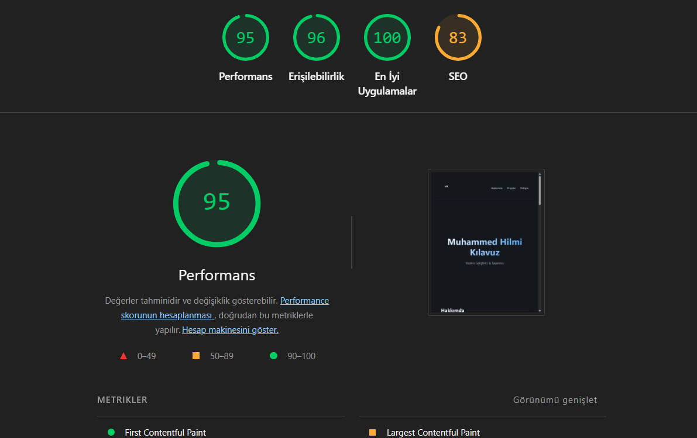

# Web LAB-2: Semantik Portföy Projesi

Bu proje, Web Tasarımı ve Programlama dersi **LAB-2** kapsamında, semantik HTML5 yapısı ve erişilebilirlik (a11y) standartlarına uygun olarak geliştirilmiş bir kişisel portföy sayfasıdır.

##  Proje Hakkında
Bu laboratuvarın temel amacı, bir web sayfasını sadece görsel olarak değil, aynı zamanda tarayıcılar, arama motorları ve ekran okuyucular için anlamlı (semantik) bir yapıda kurgulamaktır.

### Uygulanan Temel Özellikler
- **Semantik HTML5**: `<header>`, `<nav>`, `<main>`, `<section>`, `<article>` ve `<footer>` etiketleri ile hiyerarşik yapı.
- **Erişilebilirlik (a11y)**:
  - Doğru başlık (H1-H6) sıralaması.
  - Açıklayıcı `alt` metinleri.
  - "Ana İçeriğe Atla" (Skip to Content) linki.
  - Klavye ile tam kontrol ve görünür odak (focus) göstergeleri.
  - Form alanları için ARIA öznitelikleri (`aria-label`, `aria-required`).
- **Modern Form Tasarımı**:
  - `<fieldset>` ve `<legend>` ile gruplandırılmış iletişim formu.
  - HTML5 yerleşik doğrulama (required, email format, minlength).
  - `<label>` - `input` ilişkisi (for/id).

##  Geliştirici
- **Ad Soyad:** Muhammed Hilmi Kılavuz
- **Öğrenci No:** 230541085

##  Kullanılan Teknolojiler
- **Framework:** React 18
- **Programlama Dili:** TypeScript
- **Build Aracı:** Vite
- **Stil:** Modern CSS (HSL Renk Sistemi & Responsive Tasarım)

##  Kurulum ve Çalıştırma

### Gereksinimler
- Node.js (v18+)
- npm veya yarn

### Adımlar
1. Bağımlılıkları yükleyin:
   ```bash
   npm install
   ```
2. Geliştirme sunucusunu başlatın:
   ```bash
   npm run dev
   ```
3. Tarayıcıda şu adresi açın: `http://localhost:5173`

##  Proje Önizlemesi(Lighthouse Değerlendirmesi)




